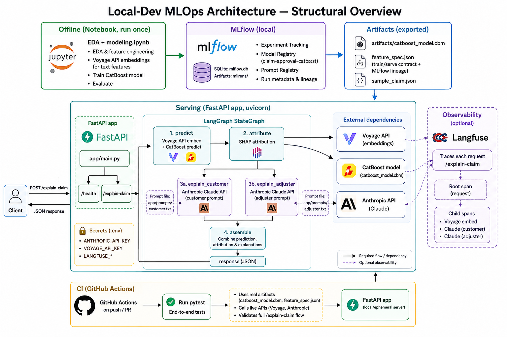

# Design Document — Claim Approval Agent

## 0. Solution design

As shown in the EDA and modeling sections, the main signal comes from free-text fields
(`issueDesc` and `other`), while the rest of the tabular data barely distinguishes between
classes. That shifts the central question from "which model" to **how should the LLM touch
the classifier**.

LLM-as-classifier contradicts both the letter and the spirit of the task. Technically, it
would no longer be explaining an ML model but making the decision itself; practically, it
would make predictions non-deterministic and unauditable, which conflicts with the
requirements of a regulated claims system.

That leaves two directions: incorporating text features before prediction, or adding them
after the tabular-data prediction, at the explanation step. The second approach seems
unreasonable, since it means ignoring the richest source of information in the database at
the modeling step — and potentially forcing the LLM to contradict its own prediction.

It's worth checking how much the metric (ROC-AUC/F1) actually changes after adding textual
features. An embedding-based approach with dimensionality reduction was chosen as the
easiest way to handle multilingual inputs. As a result, ROC-AUC rose from 0.618 to 0.730,
which is worth the effort on a dataset this small.

For a full production solution, it would be worth comparing cheaper alternatives — starting
with TF-IDF (either shared across languages or separate per language), and moving to local
HuggingFace embedding models (with the added complexity of self-hosting, and likely weaker
performance for minor languages like NL/SV/FI). An API-based approach was therefore chosen
as the fastest path.

I used **Voyage AI**, which performs well on minor languages, though it could easily be
swapped for alternatives such as OpenAI or Bedrock Titan models.

## 1. Architecture



*Full structural overview — offline training (notebook + MLflow), the serving path, external
dependencies, observability, secrets, and CI. The "Serving" box's LangGraph pipeline is
expanded in request-flow detail below:*

```
POST /explain-claim
        │
        ▼
   ┌─────────┐     ┌───────────┐     ┌──────────────────┐     ┌──────────┐
   │ predict │ ──▶ │ attribute │ ──▶ │ explain (fan-out) │ ──▶ │ assemble │ ──▶ response
   └─────────┘     └───────────┘     └──────────────────┘     └──────────┘
                                       ├─ explain_customer
                                       └─ explain_adjuster
```

LangGraph `StateGraph` (`app/graph/build.py`) over one shared `ClaimState` TypedDict
(`app/graph/state.py`). Nodes (`app/graph/nodes.py`) are small classes built once at startup
with their dependencies (CatBoost predictor, Voyage embedder, Anthropic client) injected.

- **predict**: embeds `issueDesc`/`other` live via Voyage (`voyage-4`, 256-dim each), builds
  the feature row in `artifacts/feature_spec.json`'s column order, runs CatBoost
  (`artifacts/catboost_model.cbm`). Writes `decline_probability`/`decision`.
- **attribute**: CatBoost `get_feature_importance(type="ShapValues")` on that row, split into
  per-tabular-feature SHAP values plus one summed contribution per text field
  (`text_contributions["issueDesc"]`, `["other"]`). This is the evidence the LLM explains —
  nothing invented.
- **explain (fan-out)**: `explain_customer`/`explain_adjuster` run in parallel off the same
  upstream state, writing into a shared `persona_explanations` dict via a merge reducer
  (`Annotated[dict, merge_dicts]`) so neither branch clobbers the other.
- **assemble**: builds the `ExplanationResponse` (decision, `approval_probability`, sorted
  factors, text contributions, both persona explanations).

**Train/serve contract**: `artifacts/feature_spec.json` is the explicit contract (feature
order, categorical vs. numeric handling, embedding spec), exported once from the notebook and
enforced — not re-derived — by `app/model/predictor.py`. `ClaimPredictor.__init__` raises at
startup on a feature-count mismatch, so drift fails loudly at boot, not silently at request
time. Polarity note: `target == 1` is **declined**, so `predict_proba[:, 1]` is P(decline);
the API converts to `approval_probability = 1 - P(decline)` exactly once, in `predictor.py`.

## 2. ML modeling

CatBoost classifier (`notebooks/EDA + modeling.ipynb`) on Bolttech's mock device-claim
dataset — 831 rows, 15.7% decline rate, `auto_class_weights="Balanced"`. Dropped:
constant/near-empty columns, date columns (near-zero correlation after deriving
duration/age), multi-collinear RRP variants. Hyperparameters via Optuna (30 trials, TPE) with
5-fold stratified CV.

Tabular-only the model is weak (CV AUC 0.673, held-out ROC-AUC 0.618, F1 0.273) — none of the
structured features correlate much with the target. Adding `issueDesc` embeddings (Voyage
`voyage-4`, 256-dim) lifts held-out ROC-AUC to 0.754, F1 to 0.457: most of the decision signal
is in the free text, which is also why Claude reads `issueDesc` directly during explanation
rather than relying only on the model's embedding contribution.

The shipped model (`artifacts/catboost_model.cbm`, 532 features) additionally embeds `other`
the same way. That issueDesc+other combination hasn't been separately re-measured — the
0.754/0.457 numbers above are the issueDesc-only baseline it builds on.

## 3. GenAI: prompt engineering strategy

Two persona prompts (`app/prompts/customer.txt`, `app/prompts/adjuster.txt`), same inputs
(decision, top SHAP factors, raw `issueDesc`), different register:

- **Customer**: plain language, no jargon, ~150 words, focused on what happened and next steps.
- **Adjuster**: technical, names SHAP factors and direction, compares structured-data signal
  against each text signal (`issueDesc`/`other` scored separately) — any disagreement,
  including the two text sources disagreeing with each other, is surfaced as a named
  **review flag**, never silently resolved.

Binding constraint in both prompts: explain the decision, never second-guess it. If the free
text reads more/less deniable than the structured evidence, the adjuster prompt flags that
tension for a human — it never proposes a different outcome. This keeps the LLM a narrator of
the model's SHAP evidence, not a second decision-maker; the real risk in a system like this is
the LLM quietly overriding the model's call, not hallucinated facts.

**Synthetic claim scenarios** (`notebooks/synthetic_scenario_generation.py`, offline only,
never folded into training): two modes, output to `data/`.
- *Segment coverage* (`synthetic_claims_dataset.xlsx`): one Claude call per underrepresented
  high-decline segment (`WEARABLES`, `LAPTOP`, `Theft`, `FI`), grounded by real few-shot rows,
  asserting `Declined`. Sanity-checked by running every row through `ClaimPredictor` and
  reporting agreement.
- *Boundary-challenging* (`synthetic_borderline_claims_dataset.xlsx`): prompts for
  tension between structured fields and `issueDesc`, no asserted label; oversamples 6
  candidates per segment and keeps only those landing in `(0.4, 0.6)` predicted decline
  probability (typically 2-3 of 6).

## 4. Deployment

Demo deploy: FastAPI API on Render, Streamlit UI on Streamlit Community Cloud (free tier,
includes a cold-start retry loop in `streamlit_app/ui.py` since the API sleeps when idle).

Approximate stack for target production deployment on AWS:
- **Compute**: ECS Fargate OR Lambda + API Gateway if traffic is low/bursty and the CatBoost+Voyage cold start is tolerable
- **Storage**: `artifacts/` in S3
- **Secrets**: AWS Secrets Manager
- **Networking**: API Gateway

## 5. MLOps / LLMOps

- **Model versioning**: `catboost_model.cbm` and `feature_spec.json` always move together.
  Each notebook training run logs params/metrics/artifact to MLflow
  (`sqlite:///mlflow.db` + `mlruns/`, committed — run `mlflow ui --backend-store-uri
  sqlite:///mlflow.db` to inspect) and registers the served model as
  `claim-approval-catboost`; run id and registered version are embedded in
  `feature_spec.json` so `ClaimPredictor` reports lineage at `/health` without the app
  talking to MLflow at serve time.
- **Prompt versioning**: `app/prompts/*.txt` are plain files in git, each also registered in
  the MLflow Prompt Registry (`claim-explainer-customer`, `claim-explainer-adjuster`) tagged
  with the model run id it shipped alongside.
- **CI/CD** (`.github/workflows/ci.yml`): `pytest` runs `tests/test_endpoint.py` end-to-end
  against the live model/prompts on every push/PR. Not built: image build/push and an
  IaC-managed deploy step on merge to main.
- **Monitoring (wired up)**: every `/explain-claim` request opens a Langfuse trace
  (`app/observability.py`, `None`-safe if unconfigured) with spans for `voyage-embed`,
  `explain-customer`, `explain-adjuster` (model + token usage each), plus `decision` and
  `approval_probability` on the root span as a lightweight decision log.
- **Not wired up**: model drift monitoring (live decline-rate/feature distribution vs.
  training) and automated hallucination/contradiction auditing of logged explanations
  against `decision` (straightforward to add against the same Langfuse traces, not built).

## 6. Evaluation & monitoring

- **ML metrics**: ROC-AUC/F1 on held-out data, tracked across retrains
- **GenAI metrics**: cost/tokens/latency per persona call already come from Langfuse.
  Future
  scope (not built): periodic LLM-as-judge or human-reviewed sample checking register fit,
  review-flag correctness, and zero contradiction with `decision`.
- **Responsible AI**: track decline rate/explanation outcomes against proxy attributes
  (`country`, `retailer`, `channel`) for disparate impact. Every explanation traces to specific SHAP values in the response
  (`contributing_factors`), which is what makes "explain, don't override" auditable.

## 7. Explicitly out of scope

- Auth, rate-limiting, streaming responses.
- Caching embeddings at serve time.
- Synthetic claim scenario generation (an offline notebook concern, not part of this API).
- Automated LLM-eval tooling (e.g. DeepEval/Ragas-style faithfulness/hallucination/fairness
  scoring).
- Optimal decision-threshold selection — the model's default 0.5 cutoff on `predict_proba`
  is used as-is.
